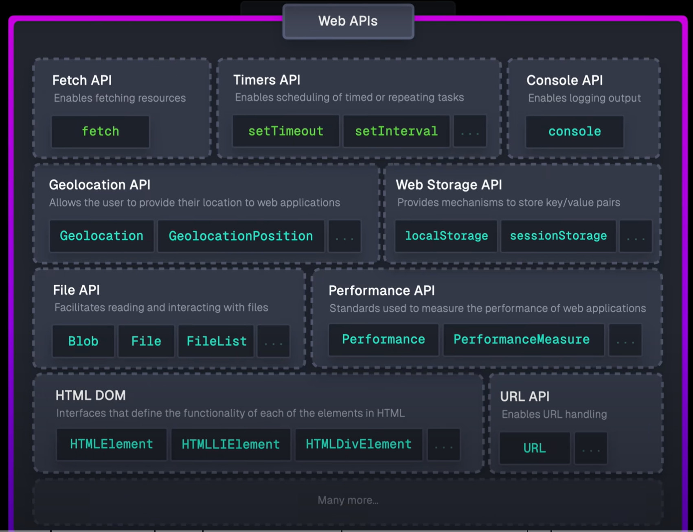

import Tabs from '@theme/Tabs'
import TabItem from '@theme/TabItem'

## Event loop

1. Synchronously execute the script until the **Call Stack** (LIFO) is empty. There are couple things that will not be added directly to the **Call Stack** but be handled by **Web APIs**. When done in **Web APIs**, the callbacks will be pushed into the **Task Queue** (for _Callback-based APIs_ e.g. `setTimeout`, `DOM` APIs, `geolocation`,...) or **Microtask Queue** (for _Promise-based APIs_ e.g. `Promise`, `MutationObserver`,...)

2. Select the **oldest** callback from **Microtask Queue**, push it into the **Call Stack** and execute it. Repeat until the **Microtask Queue** is empty.

3. Do the same like step 2 for the **Task Queue**. Note that if there is a new callback added to the **Microtask Queue** while executing the **Task Queue**, the **Microtask Queue** will still be executed first.




### Example: Test this snippet [here](https://www.jsv9000.app/)

```js
setTimeout(function a() {}, 500)
setTimeout(function b() {}, 0)
fetch('https://jsonplaceholder.typicode.com/todos/1').then(function c() {})
Promise.resolve().then(function d() {})
Promise.reject().catch(function e() {})
function f() {
  g()
}
function g() {}
f()
```

## Closure

Is the combination of a **Function** and its **Lexical environment** (_references_ to any data that the function depends on, including data from outer scope). Closure of a function is created at the time it is declared.  
_You can think of a function to have its own **"private"** variable._

```js
function f1() {
  let x = 0 // Dc giữ lại trong closure
  let y = 0 // Dc dọn dẹp bởi garbage collector
  return function f2() {
    x += 2 // f2 truy cập dc variables ở outer scope, ở đây là `x`
    return x
  }
}
// execute `f1` returns `f2` -> result == f2
// -> Variables which are in f2's Closure sẽ dc giữ lại, ở đây là `x`
const result = f1()
result() // 2
result() // 4
console.log(x) // ❌ ReferenceError: Biến `x` chỉ dc sử dụng trong `f1``
```

### Tricky example

<Tabs>
  <TabItem value="Basic" label="Basic">

```js
// When using `var` in a `for` loop, the variable is hoisted to Global Scope.
for (var i = 0; i < 3; i++) {
  // There are 3 different `log` declaration here, which means there are 3 different Closures
  // With `var`, all 3 `log` access to the same global variable `i`, which after the loop, is 3.
  // With `let`, there is a different `i` in each `for` loop since it's Block Scope
  // Put differently, each `log` access to its own `i` (`i` is a part of `log` Closure).
  const log = () => console.log(i)
  setTimeout(log, 0)
}
// EZ Fix: Use `let` instead of `var` OR get rid of `setTimeout`
```

 </TabItem>
  <TabItem value="IIFE" label="IIFE">

```js
// Fix that still use `var` and `setTimeout`
// Use IIFE (Immediately Invoked Function Expression)
for (var i = 0; i < 3; i++) {
  ;(function (i) {
    setTimeout(function () {
      console.log(i)
    }, 0)
  })(i)
}
```

  </TabItem>
  <TabItem value="Separate Fn" label="Separate Fn">

```js
// Fix that still use `var` and `setTimeout`
for (var i = 0; i < 3; i++) {
  // Create a closure to capture the current value of `i`
  const temp = function (index) {
    setTimeout(function () {
      console.log(index)
    }, 0)
  }
  temp(i)
}
```

  </TabItem>

</Tabs>

## Hoisting

JavaScript Engine moves the function and variable **declarations** to the top of the current **scope**.  
NOTE: [Unlike `var` and `function`, `let` and `const` are not initialized and accessing them before the declaration will result in a ReferenceError exception. The variable is in a "temporal dead zone" from the start of the block until the declaration is processed.](#var-deep-dive)

```js
add(3, 4); //* returns 7
// Function declaration -> hoisting lên đầu
function add(num1, num2) {
  return num1 + num2;
}

// ❌ Function expression -> ko hoisting
subtract(7, 4); // ❌ Uncaught TypeError: subtract is not a function
var subtract = function (num1, num2) {
  return num1 - num2;
};
var x; // console.log(x) -> undefined
let y; // console.log(y) -> undefined
const z; // ERROR ngay bước init
```

## `for...in` vs `for...of` + `in` keyword

```js
const arr = ['a', 'b', 'c']
const obj = { a: 1, b: 2, c: 3 }
// for...in(dex)
for (const i in arr) {
  console.log(i) // 0, 1, 2
}
for (const i in obj) {
  console.log(i) // a, b, c
  console.log(obj[i]) // 1, 2, 3
}
// `in` keyword
console.log(0 in arr) // true
console.log('a' in arr) // false (you must specify the index number, not the value at that index)
console.log('a' in obj) // true

// for...of(value)
for (const i of arr) {
  console.log(i) // 'a', 'b', 'c'
}
for (const i of obj) {
  console.log(i) // TypeError: obj is not iterable
}
```

## var let const

|         |      Scope       | Hoisting | Can be accessed before declaration |     Init value      |  Re-declare  | Update |
| :-----: | :--------------: | :------: | :--------------------------------: | :-----------------: | :----------: | :----: |
|  `var`  | Function/ Global |    ✅    |      ✅ (return `undefined`)       |     `undefined`     | ✅ undefined |   ✅   |
|  `let`  |      Block       |    ✅    |        ❌ (ReferenceError)         |     `undefined`     |      ❌      |   ✅   |
| `const` |      Block       |    ✅    |        ❌ (ReferenceError)         | MUST be initialized |      ❌      |   ❌   |

### `var` deep dive

`var` keyword are scoped to the function in which they are created, or if created outside of any function, to the global object.

```js
function foo() {
  // All variables are accessible within functions.
  var bar = 'bar'
  let baz = 'baz'

  console.log(bar) // bar
  console.log(baz) // baz
}

console.log(bar) // ReferenceError: bar is not defined
console.log(baz) // ReferenceError: baz is not defined

if (true) {
  var bar = 'bar'
  let baz = 'baz'
}

// var declared variables are accessible anywhere in the function scope.
console.log(bar) // bar
console.log(baz) // ReferenceError: baz is not defined
```

`let` and `const` are hoisted but not initialized. `var` allows this

```js
console.log(bar) // undefined
var bar = 'bar'

console.log(baz) // ReferenceError: baz is not defined
let baz = 'baz'
```

### `const` examples

```js
const obj = {}
obj.foo = 'bar' // {foo : 'bar'}
obj.foo = 'bar2' // {foo : 'bar2'}

const ar = []
ar.push('foo') // ['foo']
ar.pop() // []
```

```js
const text = 'a'
text = 'b' // ❌ error - re-assigning
const text = 'c' // ❌ error - re-declaring

const obj = {}
obj = { key1: 'foo' } // ❌ error - re-assigning
const obj = { key1: 'foo' } // ❌ error - re-declaring
```

## `this`, `bind`, `call`, `apply`

`this` refers to **the object that is calling it**. An exception is for `arrow function`, as it refers to its **enclosing scope** at the time the function is created - `window` (browser) or `global` (node)

```js
const person = {
  fn1: () => {
    console.log(this) // `window`
  },
  fn2() {
    console.log(this) // `person`
  },
  fn3() {
    // `function (item)` is called by JS global object
    this.foo.forEach(function (item) {
      console.log(this) // `window`
    })

    this.foo.forEach(function (item) {
      console.log(this) // `person`
    }, this) // the 2nd arg of `forEach` can be used as the `this` for the callback `function (item)`

    // the enclosing scope of the arrow callback `(item) => {...}` is `fn3`
    this.foo.forEach((item) => {
      console.log(this) // `person`
    })
  },
}

// `apply` takes the the 1st argument as the `this` context, the rest arguments are passed as an array
unboundFn.apply(person, [1, 2, 3]) // Here `this` is `person` obj
// `call` are similar but the rest arguments are passed normally to the function
unboundFn.call(person, 1, 2, 3) // Here `this` is `person` obj

const unboundFn = person.fn1 // using `fn2` here is the same
unboundFn() // The function gets invoked at the global scope -> Here `this` is global object
const boundFn = unboundFn.bind(person) // `bind` returns a new function with `this` set to `person`
boundFn() // Here `this` is `person` obj

// `call` and `apply` are similar to `bind` but they invoke the function immediately
```

## `switch`

```js
const foo = 0
switch (foo) {
  case 0:
    console.log(0)
  // Forgotten break! Execution falls through
  case 1: // no break statement in 'case 0:' so this case will run as well
    console.log(1)
    break // Break encountered; will not continue into 'case 2:'
  case 2:
    console.log(2)
    break
  default:
    console.log('default') // Without `break`, all cases including `default` will run
}
// Logs 0 and 1
```

### Lexical scope

```js
const action = 'say_hello'
switch (action) {
  case 'say_hello':
    const message = 'hello'
    console.log(message)
    break
  case 'say_hi':
    const message = 'hi'
    console.log(message) // ❌ SyntaxError: Identifier 'message' has already been declared
    break
  default:
    console.log('Empty action received.')
}
```

Error due to both `const` declarations being within a same `switch` block. To fix, whenever you need to use `let` or `const` declarations in a case clause, wrap it in a block.

```js
const action = 'say_hello'
switch (action) {
  case 'say_hello': {
    const message = 'hello'
    console.log(message)
    break
  }
  case 'say_hi': {
    const message = 'hi'
    console.log(message)
    break
  }
  default: {
    console.log('Empty action received.')
  }
}
```

## Types

### Primitive

- `string`; `number` (`NaN`, `Infinity`, `-Infinity`); `boolean`
- `undefined`(`typeof undefined === "undefined"`).
- `null` (`typeof null === “object”`): Mặc dù behavior giống _primitive_ nhưng lại là _object_.
- `symbol`; `bigint`

### Reference

- Array ~ Set; Object ~ Map: `typeof === “object”`
- Function: `typeof === “function"`
- `date; regexp; error; weakmap; weakset`

### Falsy values

`0, “”, false, null, undefined, NaN`

## Non-null Assertion vs Optional Chaining vs Nullish Coalescing

- `!`: Non-null assertion - Only runs at _Compile time_, nói với compiler là cái này ko `null` dc &rarr; dùng khi biết chắc obj có value rồi để skip runtime check.
- `?`: Optional chaining - Only runs at _Runtime_, nếu ko có thì trả về `undefined` &rarr; dùng khi ko biết chắc obj có value hay ko để tránh crash.
- **Nullish Coalescing**: `??`: Tương tự `|`

  - `[0/""/false/NaN] ?? expr` &rarr; `[0/""/false/NaN]`
  - `null/undefined ?? expr` &rarr; expr

## `Object.freeze` vs `.seal` vs `.preventExtensions`


